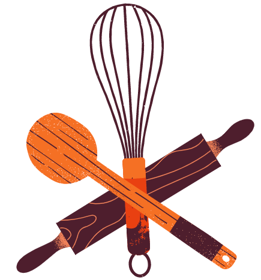
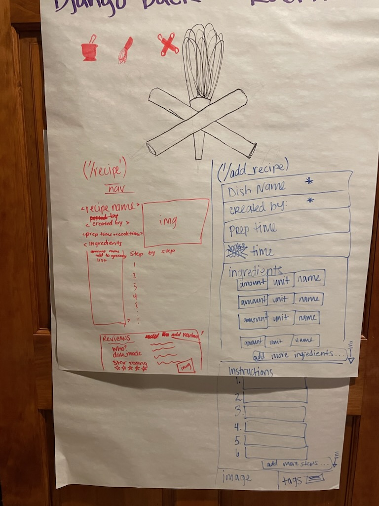
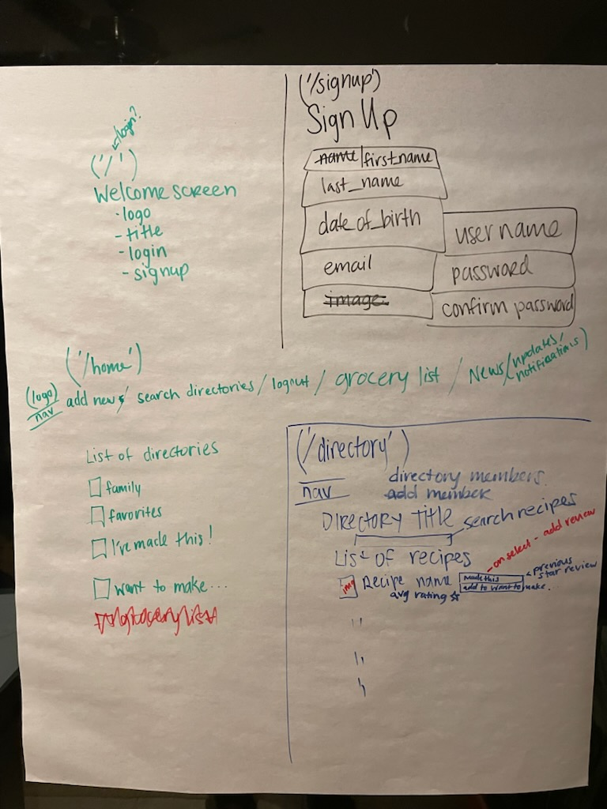

# WhiskIt!

Recipes are passed down through families and around with friends throughout our lives, but are we storing and sharing them efficiently? Now we can. With WhiskIt!, we are  able to store, add, update and share dishes that we love with those we love most no matter the distance between us. Create  recipe directories and fill them to your heart's content, rate each recipe and leave your comments and adaptations for each member of the directory to peruse. Directories are private, thanks to user authentication, in order to ensure that all the family secrets remain so. 

## Technologies
PostgreSQL database\

## Trello
https://trello.com/b/zxpbYcSg/the-grimoire

## ERD
Main Directory Model:\
 Recipe\
name = models.CharField(max_length=100)
    created_by = models.CharField(max_length=100)
    prep_time = models.CharField(max_length=50)
    cook_time = models.CharField(max_length=50)
    ingredients = models.TextField(
    instructions = models.TextField()
    image = models.CharField(max_length=300)
    tags = ArrayField(models.CharField(max_length=200), null=True)
    review = models.CharField(max_length=400)

## Wireframes

## Live Site

amazing-kelpie-7043d4.netlify.app

## Future Enhancements
*FUTURE* As a user, I can share a recipe via email / text\
*FUTURE* As a user, I can reply to a comment or review on a recipe\
